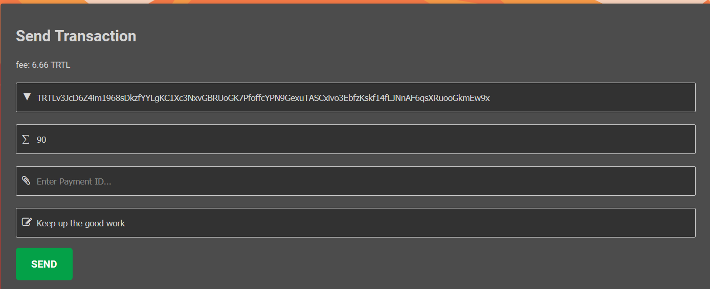

# Using TwitchTurtle as a Donator

## Tipping a Streamer

Tipping a streamer with TwitchTurtle is an easy and painless process:

1.  Register and/or login to [Shellnet](https://shellnet.pw)  
    If you're unsure how, take a look at [this guide](https://docs.turtlecoin.lol/guides/wallets/using-shellnet/#creating-a-walletsigning-up)

2.  After doing so, ensure you have some balance loaded to send (remember that a fee of 6.66 TRTL is charged per transaction)

3.  After that, enter the streamer's address, how much you want to tip, and an optional(but highly recommended) message

    

4.  Then, click `SEND`

5.  Confirm the amount and destination address, then click `CONFIRM`

That's it! Your funds are now on their way to the streamer's address and will show up promptly on their stream, if configured.

   
