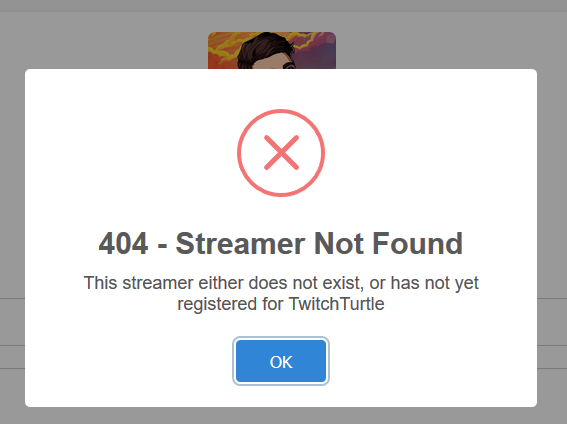
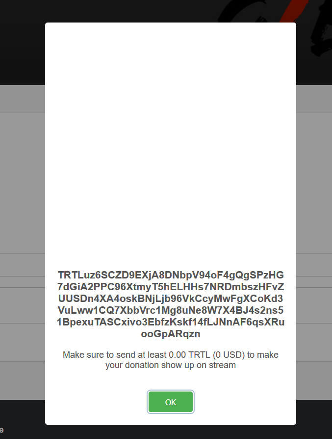

# Using TwitchTurtle as a Donator

## Tipping a Streamer

Tipping a streamer with TwitchTurtle is an easy and painless process:

1.  Go to your streamer's trtl.tv page:

    * It will be `trtl.tv/<streamer's-name>`
    * For example, if you wanted to tip [Gibuya](https://twitch.tv/gibuya), you would go to [https://trtl.tv/gibuya](https://trtl.tv/gibuya)

    *Note*: If the streamer has *not* signed up for trtl.tv, then an error message will appear. If this is the case, then your TRTLs WILL NOT go anywhere. Consider mentioning TwitchTurtle to the streamer!

    

2.  After doing so, enter a name and a message

    *Note*: Both of these are optional, but it is recommended you include them both.

    

3.  After that, you will be given an address to send TRTL to.

    

4.  Then, open up your TurtleCoin wallet, and send however much you'd like to send to the given address.

That's it! Your funds are now on their way to the streamer's address and will show up promptly on their stream, if configured.
   
