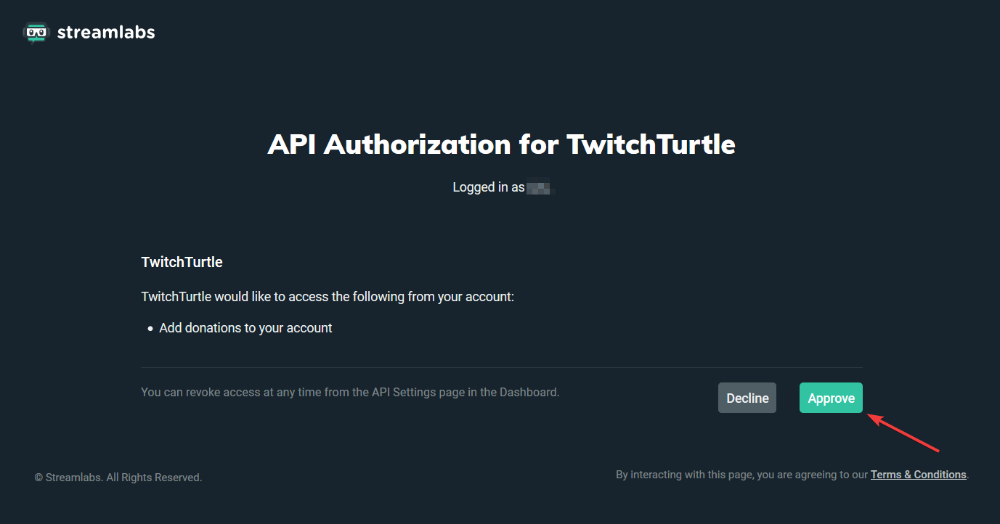
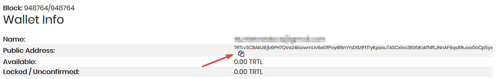
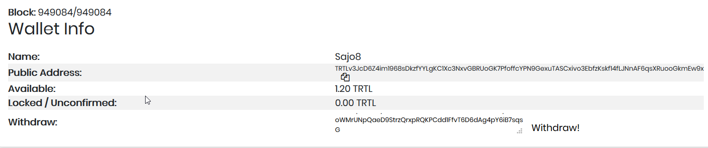

# Using TwitchTurtle Wallet as a Streamer

## Setting up an account

Setting up a TwitchTurtle account and receiving TurtleCoin tips is a very simple task, and only takes a minute:

1.  Go to [this link](https://new.twitchturtle.com)

2.  Login with either your Twitch or YouTube account, or any of the alternatives below (click Allow/Trust on any confirmation screens)

3.  If prompted, approve API authorization for TwitchTurtle

    

4.  Copy the address generated and share that with your users

    

And that's it! Any tips made to that address will now appear on your stream. Make sure you've configured tips to appear on stream!

After you're logged in, you can view your balance at [the dashboard](https://twitchturtle.com/dashboard/)

## Withdrawing Balance

Withdrawing your TRTL is also a straightforward task which hardly takes a second

1.  Open up your [dashboard](https://twitchturtle.com/dashboard/)

2.  Enter your TRTL address next to `Withdraw`

3.  Click `Withdraw!`

    

4. Confirm whether or not the address is correct; if it is, click `OK`, otherwise click `Cancel` to cancel the withdrawal

   **You *cannot* send balance from TwitchTurtle to an exchange**

5. The transaction will now be sent and on its way to the address specified!

*Note*: Withdrawals are sent 10,000 TRTL at a time; if you have more than that, you will have to withdraw funds multiple times.